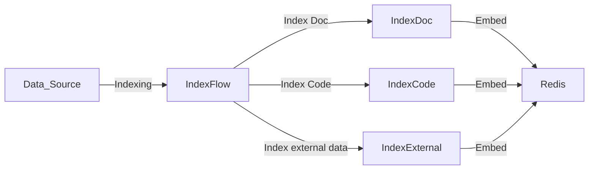
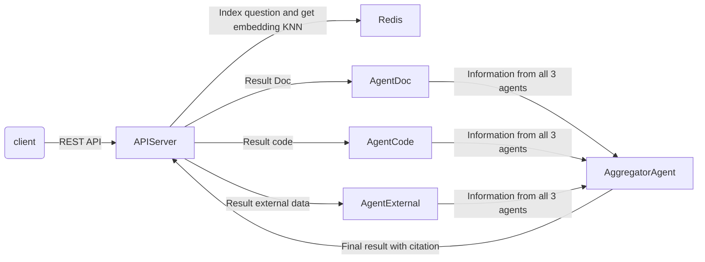

# AI knowledge infra 
Still have errors, and doesn't compile

### System Diagram

```mermaid
graph LR;
    Data_Source --> |Indexing | IndexFlow;
    IndexFlow --> |Index Doc | IndexDoc;
    IndexFlow --> |Index Code | IndexCode;
    IndexFlow --> |Index external data | IndexExternal;
    IndexDoc --> | Embed  | Redis;
    IndexCode --> | Embed | Redis;
    IndexExternal --> | Embed | Redis;
```

```mermaid
graph LR;
    User(client) --> |REST API | APIServer;
    APIServer --> |Index question and get embedding KNN| Redis;
    APIServer --> | Result Doc | AgentDoc;
    APIServer --> | Result code | AgentCode;
    APIServer --> | Result external data | AgentExternal;
    AgentDoc --> | Information from all 3 agents | AggregatorAgent;
    AgentCode --> | Information from all 3 agents | AggregatorAgent;
    AgentExternal --> | Information from all 3 agents | AggregatorAgent;
    AggregatorAgent --> | Final result with citation | APIServer;

```

